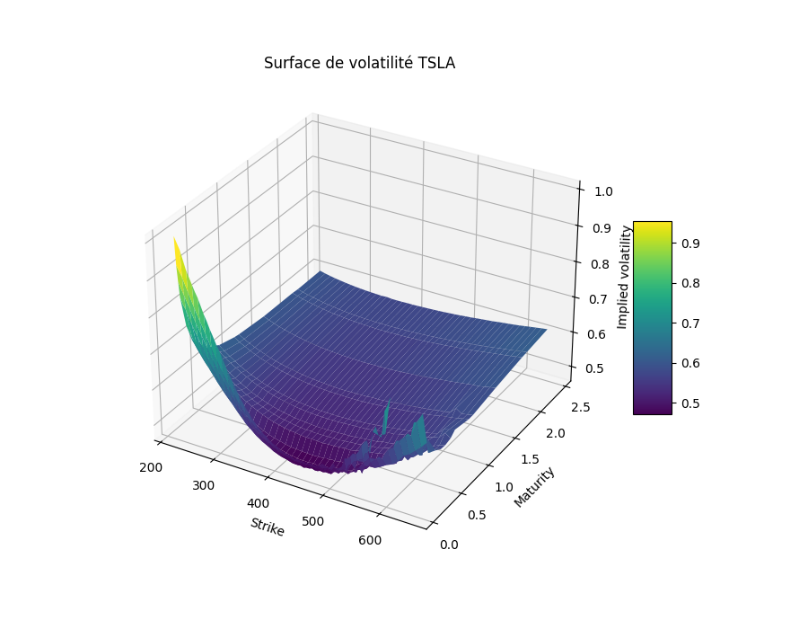
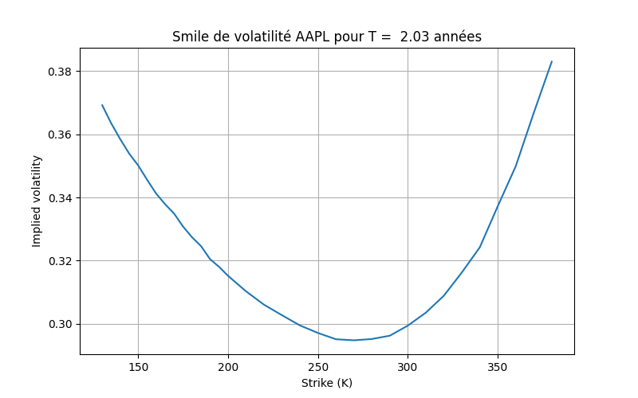

# Implied-volatility-surface-
# Analyse de la Volatilité Implicite, Smile, Surface & Grecs (Python)

Ce repo contient un petit outil que j'ai développé pour automatiser l'analyse des options. L'idée était de passer de la théorie du Master MBFA à un outil capable de sortir un "smile" ou une "surface" de vol en quelques secondes pour n'importe quel ticker.

## Ce que fait l'outil
Le script interroge l'API `yfinance` pour récupérer les chaînes d'options. Comme la volatilité implicite n'est pas directement donnée, je l'estime par **dichotomie** en inversant le modèle de Black-Scholes.

* **Volatility Smile & Surface** : Génération de graphs 3D (Matplotlib) pour visualiser le skew et la structure par terme.
* **Greeks Calculator** : Calcul du Delta, Gamma, Vega et Theta (le script exporte tout en `.csv` pour pouvoir les analyser sur Excel ensuite).
* **Nettoyage de données** : Filtre automatique des options sans liquidité (bid/ask nuls) et des maturités trop courtes qui font "exploser" la vol.

## Comment s'en servir ?
C'est du "plug and play". Tu lances le `main()` et tu suis les instructions dans le terminal :
1. Entre le ticker (ex: `NVDA`, `TSLA`, `AAPL`).
2. Choisis entre `call` ou `put`.
3. Sélectionne ce que tu veux : le `smile` sur une maturité, la `surface` complète, ou l'export des `greeks`.

### Dépendances
`pip install numpy pandas matplotlib yfinance`

## Aperçus
### Visualisation d'une Surface 

### Visualisation d'un Smile

## Pourquoi ce projet ?
Je suis actuellement en **Master 1 MBFA à l'université Lyon 2**. Ce projet me permet de manipuler concrètement les concepts de pricing, et travailler ma pratique du language Python. 

Je cherche un stage de **5 mois (avril à août 2026)** dans un **Desk de Trading**, **Trade Support** ou en tant que **Middle Office Analyst**. Si mon profil vous intéresse pour renforcer vos équipes, discutons-en !

(www.linkedin.com/in/litian-perot-9014b02b6)
